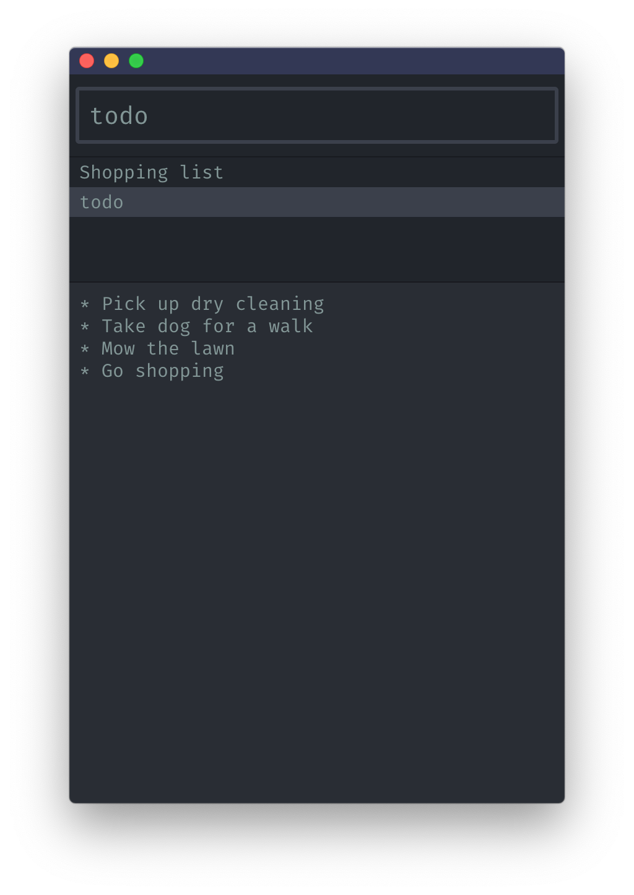

  

<h1 align="center">Noted</h1>

Your notes, powered by the keyboard

***

Noted is a note taking application inspired by [Notational Velocity](http://notational.net/). Its aim is to let you create and manage your notes with ease by using a simple and entirely keyboard driven interface.

<strong><a href="https://github.com/davidwinter/noted/releases/latest">Download for macOS</a><strong>

  

### Creating a new note

The search input is focused by default, just type the name of the new note that you'd like to create and press enter to move to the editor where you can start typing. Your note is saved automatically as you type.

### Edit an existing note

You can always push escape to return to the search input. Type some keywords of the name of your existing note. If it matches exactly, you'll see the content in the editor automatically, otherwise you can navigate the search results with the up and down arrows. Press enter once the note is selected to start editing it.

### Delete a note

With the note selected in the note list, push Command + D (Mac) to delete. A confirmation prompt will appear and you can press enter to confirm deletion.

### Help instructions

In the search input type `?`.

***

<small>Code by <a href="/davidwinter">David Winter</a> | Logo by <a href="/colinmeinke">Colin Meinke</a></small>

